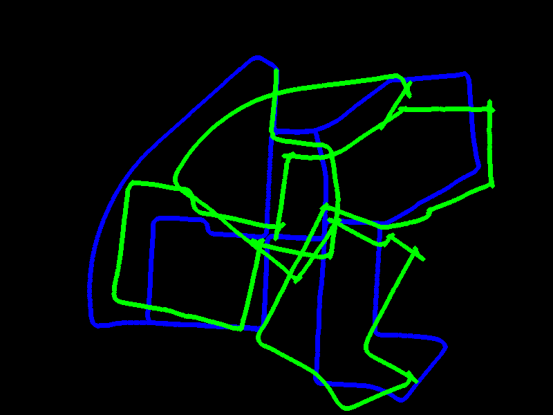

# SLAM

**Visual Odometry**

`visual_odom_cv.py` : Visual odometry using OpenCV
- Use FastFeatureDetector to detect keypoints.
- Use calcOpticalFlowPyrLK to track keypoints between frames.
- Compute the essential matrix using RANSAC.
- Compute the pose of the camera using the Essential Matrix.
- Use triangulation function to triangulate 3D points from two images
- Find the scale factor using the triangulated points

References:

https://github.com/utiasSTARS/pykitti

https://datahacker.rs/calculating-sparse-optical-flow-using-lucas-kanade-method/

https://www.cs.cmu.edu/~16385/s19/lectures/lecture21.pdf

https://github.com/lmiz100/Optical-flow-Horn-Schunck-method/tree/master

https://the-algorithms.com/algorithm/horn-schunck?lang=python